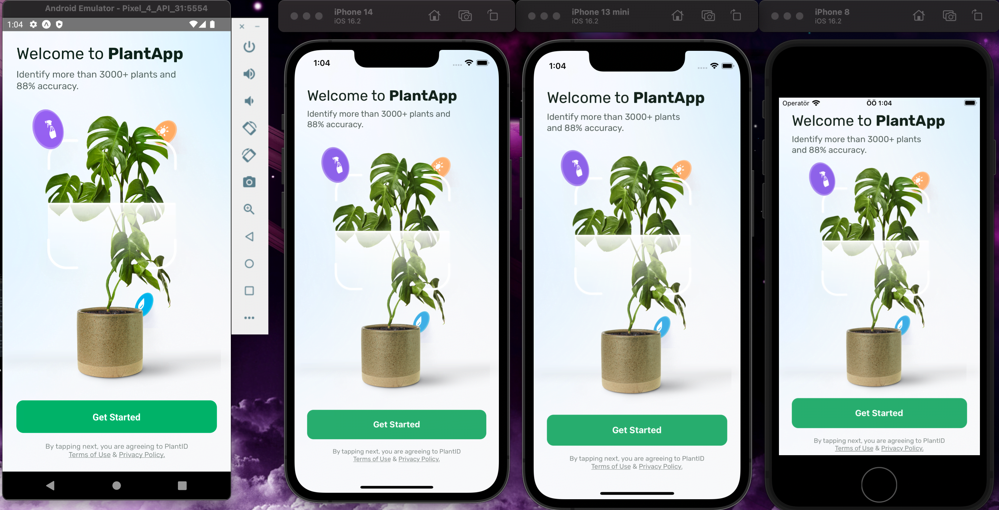
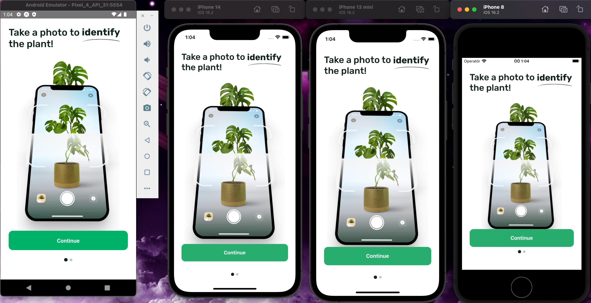
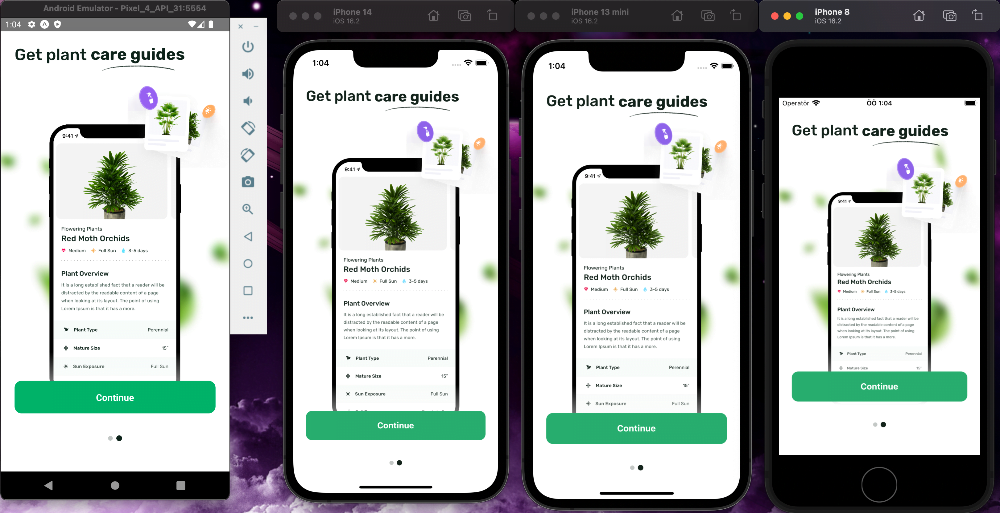
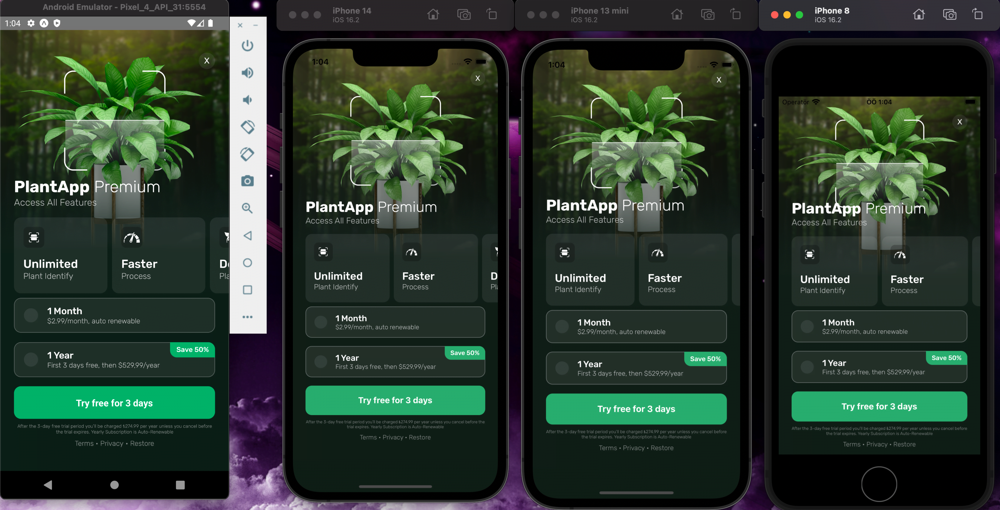
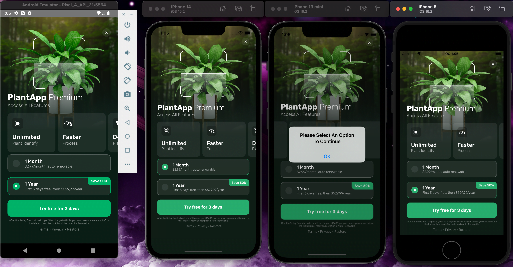
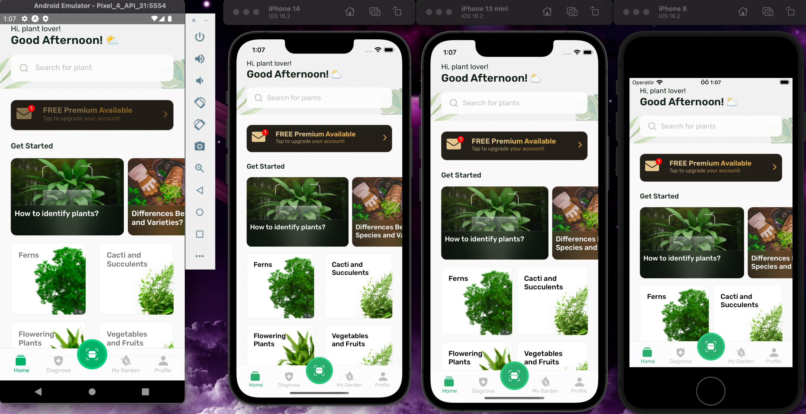

# Hub X Case

# React Native Version - 0.71.4

- To run the project:

```bash
yarn # for installing node_modules
cd ios/ # enter the ios file
pod install # for installing native pods for ios
arch -x86_64 pod install # if you are using m1 chip. otherwise skip this line
yarn start # starts the metro server
yarn ios # starts the app on ios simulator
yarn android # starts the app on android emulator
```

## Used Packages

1. react-navigation: to navigate between pages
2. reduxjs/toolkit: to fetch data from apis and saving on global states
3. axios: to fetch data from apis
4. react
5. react-native
6. react-redux: to manage global states
7. react-native-linear-gradient: to give components a gradient appearance
8. react-native-safe-area-context: helper package for react-navigation
9. react-native-screens: helper package for react-navigation
10. react-native-vector-icons: to use icons and custom fonts
11. react-native-swiper: to create onboarding screens
12. react-native-masked-view/masked-view: to create gradient viewed text component

## Screenshots












